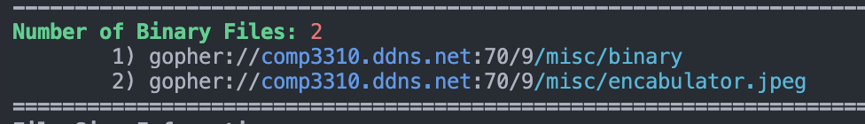
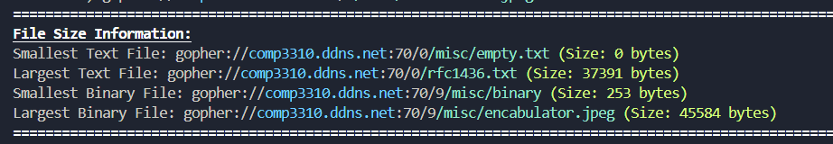

# COMP3310 Indexing a Gopher 🎉

## Work of Samman Palihapitiya

> For this assignment, you need to write your own gopher client in C, Java or Python. The client will need to 'spider' or 'crawl' or 'index' a specified server, do some simple analysis and reporting of waht resources are there, as well as detect, report and deal with any issues with the server or its content.

### RFC 1436: The Internet Gopher Protocol

* Operates on port 70 by default
* Requests to a Gopher server are simple strings - followed by a CR carriage return and LF line feed (i.e., `\r\n`)
* Server's response can be directiories, text files or other - 0 for text files and 1 for directories

More on this at section 3.8 'Item type characters' found [here](https://www.rfc-editor.org/rfc/rfc1436).

---

### How to Execute: 💻

Ensure you have the latest python version.

Use your terminal to navigate to the directory where you have saved the gopher-client.

Then execute:

```
python gopher_client.py
```

#### Output Samples:





---

### Design Choices: 👨‍🔧

In order to handle `Badly behaved pages` I had a collection of different approaches:

`Firehose` - This resource sends an infinite stream of data as long as the socket is kept open, so in order to handle resources like this I've implemented a `max_size` restriction of 0.5MB to files. In the `download_file` function, we essentially keep requesting until the bytes received is less than `max_size`. There's no particular reason for choosing 0.5MB, it seemed large enough for a text file whilst still keeping my gopher-client functional/responsive.

`Tarpit` - This is a resource that responds very slowly and is seemingly never ending. My approach to this was to implement the timeout attribute. The `socket.settimeout` attribute isn't effective for this as it only times out if there is no activity during the set period, however `tarpit` bypasses this as it does send responses - only very slowly. Therefore, I needed to set up my own `start_time` to handle such files to avoid lengthy hangs/infinite streams. I've currently set both the socket timeout and my own timeout variable to 5 seconds as this seemed like a fair time period to handle somewhat slow responses without compromising the responsiveness of my gopher-client.

`Godot` - As per the file description, this file never comes - therefore, this was easily handled by the timeout setting of the socket object.

#### General:

In order to exclude text/binary files that resulted in an error or some overflow, I've decided to return size as `None` in the event of a timeout or max size being exceeded. By doing so, I am able to exclude them in the comparison done in `find_largest_and_smallest_files()` function.

Each time a request is send, I've allowed "room for failure" in the sense that I re-attempt to send requests that fail through an execption handling processes. Again this is limited to only 2 attempts to keep the gopher client responsive and functional. Request fails have been uncommon so far during my implementation but I am aware that they do occur through connection loss.

I've also utilised gopher URLs has complete paths - this is simply my interpretation of what a full path is in the context of the assignment as the URLs do provide the exact path to access the server's content using tools like FloodGap.

With regards to performance of the indexer, my gopher client is as fast as the server allows given the limitations around sockets that need to timeout in order to handle the malformed/badly behaving resources. However, this is not confirmed using any emprirical method or a standard - just simply observations.

As an additional feature, I have interpretted the prefix 'i' to be informational messages stored throughout our target gopher server.

---

### Known Limitations/Bugs: 🤕

* hard limit of size of file set to 0.5MB, potentially losing valuable information
* hard limit to socket timeout, again can lead to losing valuable contents
* processing is explicit for directories, images, binary or text files - meaning other files are not handled as well
* external references are filtered simply based on whether a line response has the string: host or port in it, although, it works for our assignment envrionment and the course's gopher server - nothing is stopping someone from adding an external reference for which our host or the number 70 is present as part of it's path or url. This would cause it to bypass our check.
  * ```
    if HOST not in line or str(PORT) not in line:
                    handle_ex_refs(line)
    ```
* vice versa, we could potentially misidentify external references which are part of the course's gopher server but is located elsewhere -> leads back to how we define external references.
* invalid references are not handled but simply dumped as lines -> hard to digest and trace
  * note that I have interpretted these to be unique "lines" returned by the gopher sever, not directory or files - this essentially meant checking if a given line response contains the error prefix (3).
* Since I've set the timeout to 5 seconds and max size to 0.5MB the crawling is slower than it could be - in order to improve this speed we can reduce the timeout buffer and the max size as needed.

---

### `comp3310.ddns.net` index stats:

| Count Information               |
| -------------------------------- |
| Number of Directories: 41        |
| Number of External References: 3 |
| Number of Invalid References: 5  |
| Number of Text Files: 12         |
| Number of Binary Files: 2        |

| File/Group                                           | Size (bytes) |
| ---------------------------------------------------- | ------------ |
| Smallest Text File<br />`/misc/empty.txt`          | 0            |
| Largest Text File<br />`/rfc1436.txt`              | 37391        |
| Smallest Binary File<br />`/misc/binary`           | 251          |
| Largest Binary Files<br />`/misc/encabulator.jpeg` | 45584        |

---

### Wireshark Response: 🦈


Shown above is a snippet of the initial TCP three-way handshake, followed by the response from the course gopher server. I've expanded the gopher response received in line 63 as it is pretty digestible and evident of containing the initial root directory's content.

### Requirements

You may need to execute my python script in a powershell to be able to view the styled/coloured print output. Although it is not necessary, without it, you will see a lot ANSI characters that make no sense to you.
Any terminal with ANSI enabled or working will be able to see the intended print style/colours.
