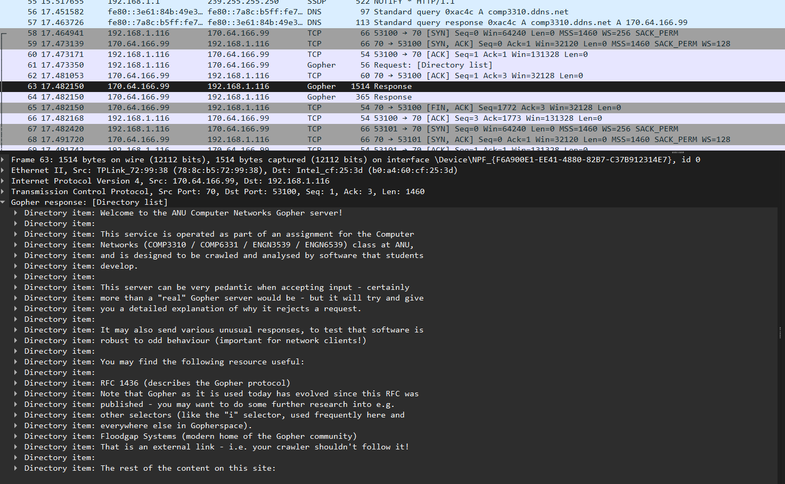

# COMP3310 Assignment 2 - Indexing a Gopher

## 2024 Semester 1 - U7287889 - Samman Palihapitiya

> For this assignment, you need to write your own gopher client in C, Java or Python. The client will need to 'spider' or 'crawl' or 'index' a specified server, do some simple analysis and reporting of waht resources are there, as well as detect, report and deal with any issues with the server or its content.

### RFC 1436: The Internet Gopher Protocol

* Operates on port 70 by default
* Requests to a Gopher server are simple strings - followed by a CR carriage return and LF line feed (i.e., `\r\n`)
* Server's response can be directiories, text files or other - 0 for text files and 1 for directories

More on this at section 3.8 'Item type characters' found [here](https://www.rfc-editor.org/rfc/rfc1436).

---

### How to Execute:

Ensure you have the latest python version.

Navigate to the directory where you have saved the gopher-client in your terminal.

Then execute:

```
python gopher_client.py
```

---

### Design Choices:

In order to handle `Badly behaved pages` I had a collection of different approaches:

`Firehose` - This resource sends an infinite stream of data as long as the socket is kept open, so in order to handle resources like this I've implemented a `max_size` restriction of 1MB to files. In the `download_file` function, we essentially keep requesting until the bytes received is less than `max_size`. There's no particular reason for choosing 1MB, it seemed large enough for a text file whilst still keeping my gopher-client functional.

`Tarpit` - This is a resource that responds very slowly and is seemingly never ending. My approach to this was to implement the timeout attribute. The `socket.settimeout` attribute isn't effective for this as it only times out if there is no activity during the set period, however `tarpit` bypasses this as it does send responses - only very slowly. Therefore, I needed to set up my own `start_time` to handle such files to avoid lengthy hangs/infinite streams. I've currently set both the socket timeout and my own timeout variable to 10 seconds as this seemed like a fair time period to handle somewhat slow responses without compromising the responsiveness of my gopher-client.

`Godot` - As per the file description, this file never comes - therefore, this was easily handled by the timeout setting of the socket.

In order to exclude text/binary files that resulted in an error or some overflow, I've decided to return size as 0 in the event of a timeout or size being exceeded. By doing so, I am able to exclude them in the comparison done in `find_largest_and_smallest_files()` function.

---

### Known Limitations/Bugs:

* hard limit of size of file set to 1MB, potentially losing valuable information
* hard limit to socket timeout, again can lead to losing valuable contents
* processing is explicit for directories, images, binary or text files - meaning other files are not handled as well
* external references are filtered simply based on whether a line response has the string: "comp3310", although, it works for our assignment envrionment and the course's gopher server - nothing is stopping someone from adding an external reference for which the phrase 'comp3310' is present as part of it's path or url.
* vice versa, we could potentially misidentify external references which are part of the course's gopher server but is located elsewhere -> leads back to how we define external references.
* invalid references are not handled but simply dumped as lines -> hard to digest and trace
* Since I've set the timeout to 10 seconds and max size to 1MB the crawling is slower than it could be - in order to improve this speed we can reduce the timeout buffer and the max size as needed.

---

### Wireshark Response:



Shown above is a snippet of the initial TCP three-way handshake, followed by the response from the course gopher server. I've expanded the gopher response received in line 63 as it is pretty digestible and evident of containing the initial root directory's content. I've also dumped the gopher packets from wireshark into an excel sheet (`Wiresharkcket_Dump.xlsx`)

---

### Requirements

You may need to execute my python script in a powershell to be able to view the styled/coloured print output. Although it is not necessary, without it, you will see a lot ANSI characters that make no sense to you.
Any terminal with ANSI enabled or working will be able to see the intended print style/colours.
